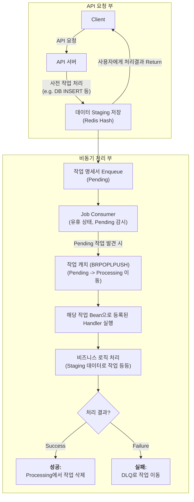

# 이름
    `Redis List`를 활용한 작업 순서 보장 Queue

# 기술 스택
    `Docker`, `Redis`, `Spring Boot 3.5.4`, `Java 17`, `Junit5`

# 목적
    1. 단순한 Redis Queue로는 순차 처리는 가능하나 데이터의 정합성을 보장 할 수 없음.
    2. Linux Daemon에서 착안하여 현재 작업 스캐줄이 끝나지 않으면 다음 작업을 진행 시키지 않는 구조의 Redis Queue를 구현
    ※ 마이크로 서비스 아키텍쳐(MSA) 방식에서 사용하는 Redis Stream, Message Queue랑은 다르게 모놀리식 아키텍쳐(MA)에서 사용하기 위해 구현함 
    ※ 라이프 사이클 제어를 위해 SmartLifecycle를 상속하여 라이프 사이클을 제어하여 Queue의 작업이 종료되기를 기다리며 안전하게 Shutdown이 되도록 Graceful Shutdown을 구현

# 사용방법
    - 그대로 MA 구조의 프로젝트에 붙여넣기해서 사용하면 된다.
    - 사용자가 수정해야하는 부분은 다음과 같다.
        1. JobHandlerConfiguration.java 파일 내부에 사용할 Bean을 등록해 준다.
        2. com/test/redis/demo/queue/key 경로에 있는 ENUM 파일은 프로젝트 구조에 맞게 설정해 준다.
        3. JobConsumerConfig.java 파일 내부에 사용할 Bean을 등록해준다.
        4. Redis TTL은 본인의 환경에 맞게 설정한다.

# 동작 방식

# 향후 계획
- [ ] 테스트 코드 작성 마무리
- [ ] DLQ 처리 작업(재시도 혹은 메일링 서비스)

