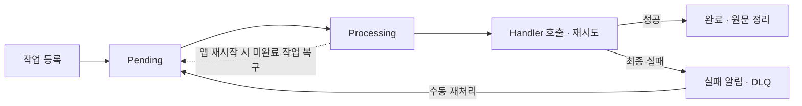

# Redis 기반 순차 작업 큐

**앞 작업이 끝나야 다음 작업을 실행하는** Spring Boot 비동기 작업 큐입니다.
Redis List와 큐별 Consumer 하나로 처리 순서를 유지하며, 업무 로직은 Handler로 분리합니다.

Java 17 · Spring Boot 3.5.4 · Spring Data Redis · Docker · JUnit 5 · Testcontainers

## 처리 흐름


```mermaid
flowchart LR
    A[작업 등록] --> B[Pending]
    B --> C[Processing]
    C --> D[Handler 호출 · 재시도]
    D -->|성공| E[완료 · 원문 정리]
    D -->|최종 실패| F[실패 알림 · DLQ]
    F -->|수동 재처리| B
    C -.->|앱 재시작 시 미완료 작업 복구| B
```

- **순차 처리**: 호출 재시도가 끝날 때까지 같은 큐의 다음 작업은 대기합니다.
- **장애 대응**: 미완료 작업을 추적하고, 재시작 시 복구합니다. 최종 실패는 DLQ에 보관합니다.
- **종료 처리**: 진행 중 작업의 완료를 기다리고, 제한 시간 이후 취소된 작업은 복구 대상으로 남깁니다.
- **운영 기능**: DLQ 조회·수동 재처리, 큐 상태 점검, 보존 기간에 따른 정리를 제공합니다.

## 실행

JDK 17과 실행 중인 Docker 엔진이 필요합니다.

```sh
docker compose up -d --wait
```

```powershell
# Windows
.\gradlew.bat bootRun --args="--spring.profiles.active=demo"
```

```sh
# macOS / Linux
bash ./gradlew bootRun --args='--spring.profiles.active=demo'
```

Redis는 실제로 사용하며, 외부 업무 호출과 메일 발송은 **Mock 로그**로 확인합니다.
데모는 즉시 성공, 재시도 후 성공, 최종 실패의 3개 작업을 등록합니다.
실서비스 연동 시 `UserJobClient`와 `FailureNotification` 구현을 교체합니다.

## 검증 및 적용 범위

`./gradlew.bat clean build` (Windows) 또는 `bash ./gradlew clean build`로 테스트합니다.
Testcontainers의 실제 Redis를 사용해 순차 처리, 종료, 복구, 재시도 및 DLQ 정책을 검증합니다.

**단일 애플리케이션 인스턴스·standalone Redis 기준**입니다. 실패 작업을 DLQ로 옮긴 뒤 다음 작업은 계속 진행합니다.
작업은 복구 시 재실행될 수 있으므로 실제 업무의 중복 반영 방지는 연동 서비스에서 처리해야 합니다.

[상세 가이드](docs/operations.md)
