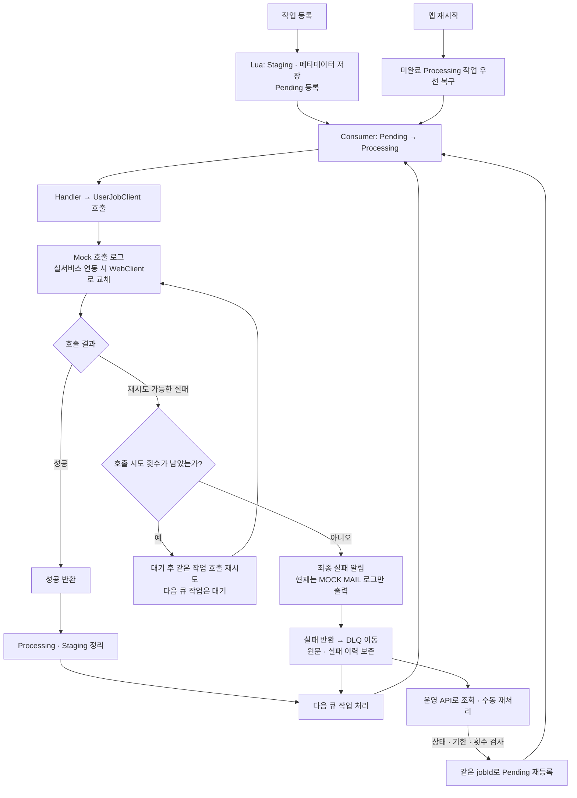

# Redis List 기반 순차 작업 Queue

Redis List를 활용해 **현재 작업 호출이 끝난 뒤 다음 작업을 처리**하는 Spring Boot 기반 비동기 작업 큐입니다. 단일 인스턴스의 모놀리식 애플리케이션에서 사용할 수 있도록 Consumer와 실제 업무 호출 부분을 분리했습니다.

## 기술 스택

Java 17 · Spring Boot 3.5.4 · Spring Data Redis · Docker · JUnit 5 · Testcontainers

별도 `database` 프로필에서 Spring JDBC와 H2를 이용한 DB 멱등성·복구 예제도 실행할 수 있습니다.

## 목적

- 큐마다 Consumer 하나가 작업을 순차 처리합니다.
- 작업을 꺼낼 때 Pending에서 Processing으로 이동시켜 미완료 작업을 추적합니다.
- `SmartLifecycle`로 종료 순서를 제어하고 진행 중인 작업이 끝나기를 기다립니다.
- 실제 서비스에 붙이기 전에는 작업 호출·재시도·최종 실패 알림을 Mock 로그로 확인합니다.

## 동작 방식

실제 서비스에서는 `UserJobClient`를 WebClient 기반 호출 구현으로 교체합니다. 호출 어댑터가 재시도를 마치고 최종 결과를 반환할 때까지 Consumer가 기다리므로, 재시도 중에는 같은 큐의 다음 작업이 실행되지 않습니다.


```mermaid
flowchart TD
    A["작업 등록"] --> B["Lua: Staging · 메타데이터 저장<br/>Pending 등록"]
    B --> C["Consumer: Pending → Processing"]
    C --> D["Handler → UserJobClient 호출"]
    D --> E["Mock 호출 로그<br/>실서비스 연동 시 WebClient로 교체"]
    E --> F{"호출 결과"}
    F -->|성공| G["성공 반환"]
    F -->|재시도 가능한 실패| R{"호출 시도 횟수가 남았는가?"}
    R -->|예| W["대기 후 같은 작업 호출 재시도<br/>다음 큐 작업은 대기"]
    W --> E
    R -->|아니오| M["최종 실패 알림<br/>현재는 MOCK MAIL 로그만 출력"]
    M --> H["실패 반환 → DLQ 이동<br/>원문 · 실패 이력 보존"]
    G --> I["Processing · Staging 정리"]
    I --> N["다음 큐 작업 처리"]
    H --> N
    N --> C
    H --> O["운영 API로 조회 · 수동 재처리"]
    O -->|상태 · 기한 · 횟수 검사| B2["같은 jobId로 Pending 재등록"]
    B2 --> C
    S["앱 재시작"] --> P["미완료 Processing 작업 우선 복구"]
    P --> C
```

**호출 재시도와 DLQ 재처리는 별개입니다.** Mock 호출은 최초 호출 포함 최대 3회 시도하며 기본 간격은 100ms입니다. 내부 호출을 3번 시도하더라도 큐의 `attempts`는 Handler 실행 1회로 기록됩니다. DLQ의 수동 재처리는 큐 실행 횟수 한도인 `queue.policy.max-attempts`를 따릅니다.

## Mock 데모 실행

JDK 17과 실행 중인 Docker 엔진이 필요합니다. Redis와 큐의 상태 변경은 실제로 실행하고, 외부 업무 호출·메일 발송은 로그로 대체합니다. 기본 모드에서는 DB를 생성하거나 Webhook을 발송하지 않습니다.

```sh
docker compose up -d --wait
```

Windows PowerShell:

```powershell
.\gradlew.bat bootRun --args="--spring.profiles.active=demo"
```

macOS / Linux:

```sh
bash ./gradlew bootRun --args='--spring.profiles.active=demo'
```

`demo` 프로필은 아래 작업 3개를 등록합니다. 주소는 외부 요청의 목적지가 아닌 Mock 시나리오 식별값입니다.

| 예제 데이터의 email | 동작 | 최종 상태 |
|---|---|---|
| `success@example.invalid` | 첫 호출 성공 | SUCCEEDED |
| `retry@example.invalid` | 2회 실패 후 3번째 호출 성공 | SUCCEEDED |
| `fail@example.invalid` | 3회 모두 실패, 최종 실패 알림 로그 | DLQ |

```text
[MOCK CALL] jobId=..., attempt=1/3
[MOCK FAILURE] jobId=..., attempt=1
[MOCK RETRY] jobId=..., nextAttempt=2
...
[MOCK SUCCESS] jobId=..., attempt=3

# 모든 호출 시도가 실패한 작업에만 출력
[MOCK MAIL] final failure: jobId=..., reason=... (no email sent)
```

새 Redis 데이터에서 실행하면 작업 2개가 성공하고 1개가 DLQ에 남습니다. `demo` 없이 실행하면 작업을 자동 등록하지 않습니다. `Ctrl+C`로 정상 종료합니다.

## 실제 서비스 연결 지점

| 인터페이스 | 현재 구현 | 연동 시 역할 |
|---|---|---|
| `UserJobClient` | `MockUserJobClient` | WebClient 호출, 오류 분류, 호출 제한 시간·재시도 정책 |
| `FailureNotification` | `LoggingFailureNotification` | 최종 실패 시 회사 메일 서비스 호출 |

기본 Mock Bean을 실제 어댑터 Bean으로 교체하면 됩니다. WebClient 구현은 `subscribe()`만 호출하고 성공을 반환하지 말고, **재시도를 포함한 최종 결과를 Handler에 전달**해야 합니다. 작업 복구·재처리 시 같은 jobId를 전달하고, 중복 반영 방지는 실제 작업을 수행하는 서비스에서 처리해야 합니다.

Mock은 호출 흐름을 보여주는 예제이므로 실제 HTTP 상태 코드별 재시도 정책이나 원격 서비스의 멱등성을 구현하지는 않습니다. 종료로 인한 interrupt는 최종 실패 메일 대상으로 취급하지 않고 Processing에 남겨 복구합니다. 알림 어댑터가 예외를 던져도 작업은 DLQ로 이동합니다. 실제 메일의 전달 보장·별도 발송 재시도는 연결하는 메일 서비스의 책임입니다.

## Graceful Shutdown

종료 시 Consumer의 다음 작업 획득을 멈추고 현재 작업을 최대 45초 기다립니다. 시간이 지나면 취소와 interrupt를 요청하고 5초 동안 정리 완료를 기다립니다. 실제 Consumer 스레드가 끝나야 Spring에 종료 완료를 알립니다.

이 대기 시간의 합은 `spring.lifecycle.timeout-per-shutdown-phase`(기본 60초)보다 짧아야 합니다. Spring의 제한 시간을 넘긴 뒤 `@PreDestroy`에서만 interrupt하면 Redis 연결 팩토리가 이미 종료되어 `LettuceConnectionFactory has been STOPPED` 또는 `was destroyed` 오류가 발생할 수 있기 때문입니다.

취소된 작업은 Processing에 남기며, Handler가 interrupt를 무시하고 뒤늦게 성공을 반환해도 큐의 완료 처리를 하지 않습니다. 외부 Handler 자체가 취소를 무시하거나 별도로 Redis를 사용한다면 강제 종료와 자원 접근까지 보장할 수 없으므로, 연동하는 호출에도 제한 시간과 취소 처리가 필요합니다.

## 운영 기능

DLQ 조회·수동 재처리 API, 큐·Consumer 상태 점검, 보존 기간 정리는 사용할 수 있습니다. API를 사용하려면 `QUEUE_OPS_TOKEN`을 설정합니다.

- Pending·Processing 원문: 자동 삭제하지 않음
- 성공한 작업 원문: 성공 처리 시 삭제
- DLQ 원문: 마지막 실패부터 30일 보존 후 EXPIRED 처리
- 종료된 작업 메타데이터: 90일 보존

[운영 API·설정 가이드](docs/operations.md)에서 상세 사용법을 확인할 수 있습니다. 기존 DB 멱등성 예제는 `--spring.profiles.active=database,demo`로 실행하며, 해당 모드에서만 DB 저장과 설정된 Webhook 발송을 활성화합니다.

## 테스트 및 기존 계획 완료

- [x] 테스트 코드 작성 마무리 — 순차 처리, 종료, Mock 호출 재시도·최종 실패 알림, DB 복구, DLQ·보존 정책 검증
- [x] DLQ 처리 작업 — 실패 이력 조회·수동 재처리 및 알림 연동 지점 구현

```powershell
.\gradlew.bat clean build
```

```sh
bash ./gradlew clean build
```

테스트는 별도의 Redis 컨테이너, 테스트용 DB, 로컬 HTTP 수신 서버를 사용합니다. HTML 결과는 `build/reports/tests/test/index.html`에 생성됩니다.

## 적용 범위

단일 인스턴스·standalone Redis 기준입니다. 최종 실패 작업을 DLQ로 보낸 뒤 다음 작업은 진행하며, DLQ 재처리는 기존 Pending 뒤에 등록됩니다. 원격 호출의 부수 효과나 새 등록 요청의 중복까지 큐 자체가 보장하지는 않습니다.
